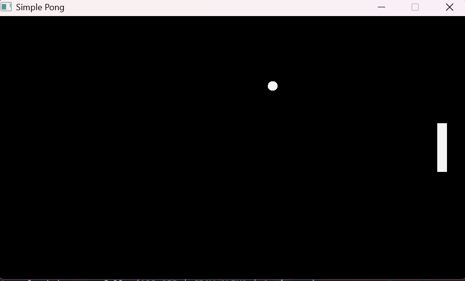

# Pong Museum

> We were supposed to make Pong.

**Pong Museum** is a collection of Pong projects created by members of game development club.

Everyone starts with the same painfully simple idea: two paddles, one ball, and a score.

What happens after that is up to them.

This repository serves as a gallery for those projects.

 Want to add your own Pong?

See [Add Your Pong](ADD_YOUR_PONG.md).

## Why a Museum?

Because apparently one Pong project was not enough

## Original Pong project

The original club Pong project can be found here:  [Pong](https://github.com/Saddleback-Game-Sim/Club-Project-Reference/tree/main)

## Gallery

### Pong!!...??

[](Pong!!)

**By:** [AKIL](https://github.com/game-simulation-saddleback)

A Pong game.

But... something seems wrong.

**Built with:** C++, raylib, raymedia, FFmpeg

[View Repository →](Pong!!)
```
